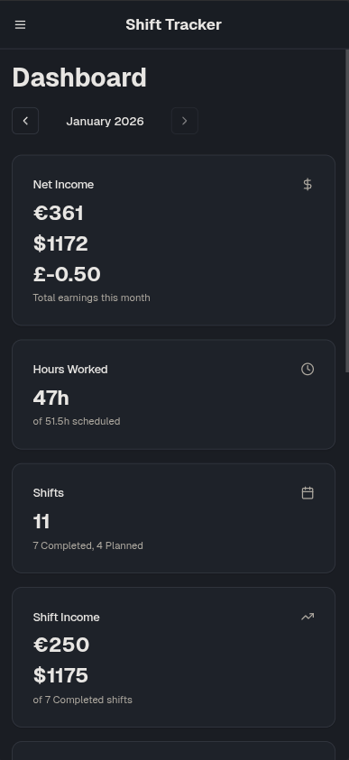
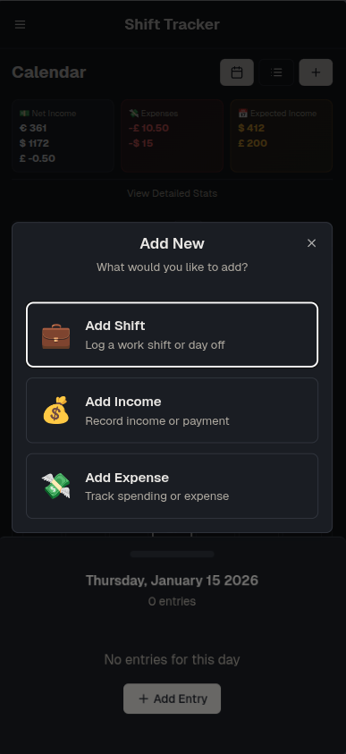
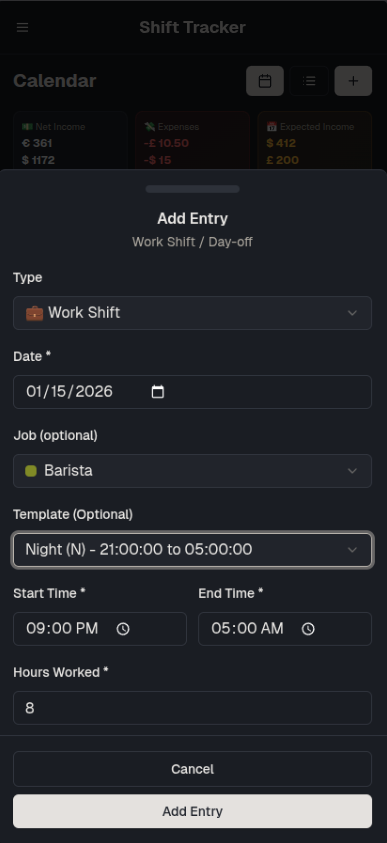
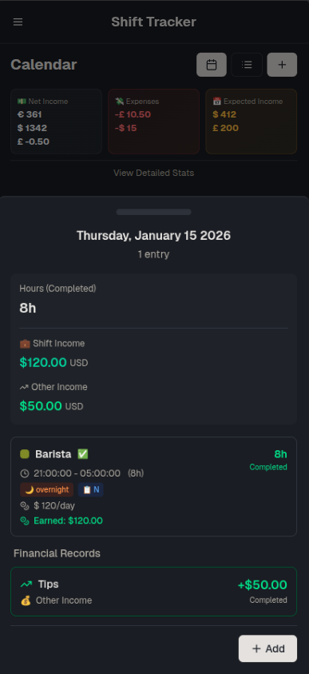
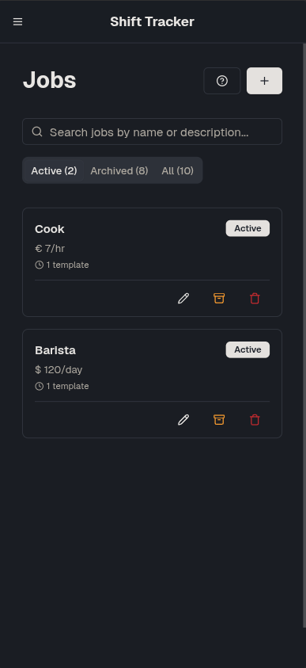
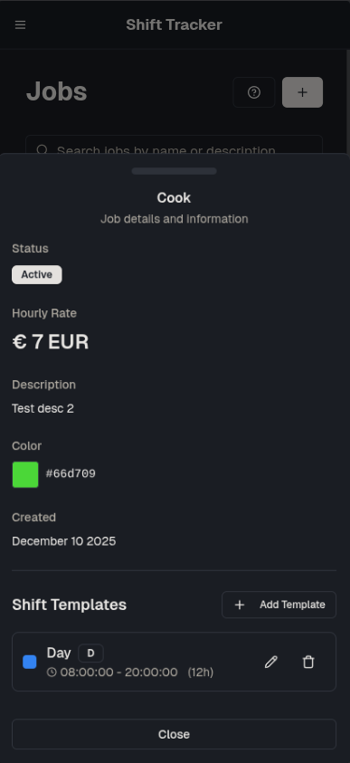

# Shift Tracker

A time tracking solution built as a personal project.

**Live Demo:** [shift-tracker-livid.vercel.app](https://shift-tracker-livid.vercel.app/)

## Overview

Shift Tracker is a lightweight pet project designed for self-use, providing an efficient way to monitor and track your work hours and time allocation.
| | | | |
|:---:|:---:|:---:|:---:|
|  |  |  |  |

| | | |
|:---:|:---:|:---:|
|  |  |  |

